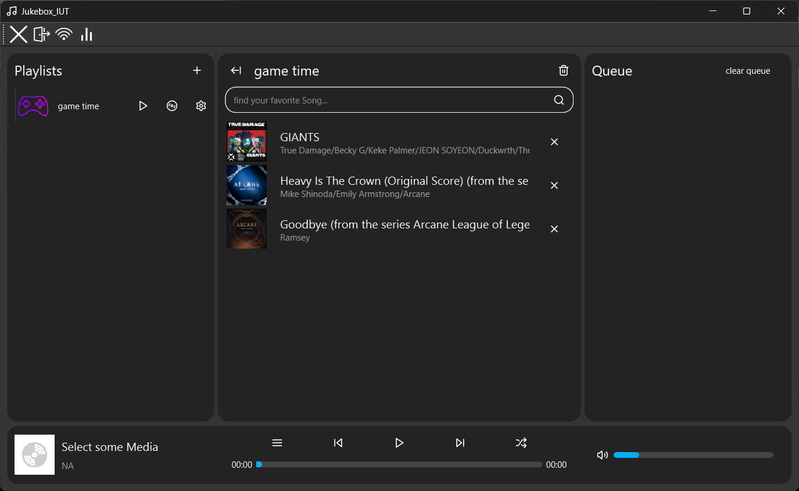
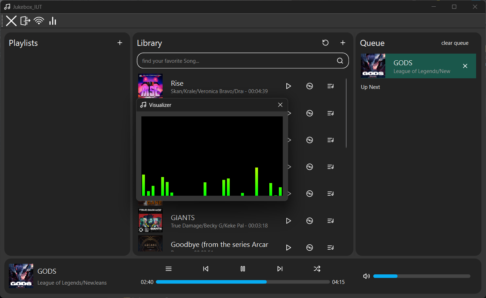
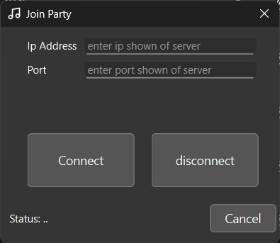
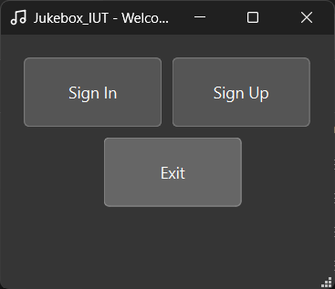

# Jukebox_IUT Music Player 🎵

This is our final project for the *Advanced Programming* course (Semester 2).  
A cool, locally-built music player with modern features and the ability to share music on a local network.

---

## 👥 Authors
- [@SoheilTornado](https://www.github.com/SoheilTornado)
- [@wolf979](https://github.com/wolf979)

---

## 🚀 Installation

1. Download the `installer` folder from the repository.
2. Run the installer (`Jukebox_SETUP.exe`) and follow the instructions.

---

## 📌 Features

- 🎨 **Modern UI** with a stable and responsive build  
- 🎧 All standard features of a media player  
- 📈 **Semi-smart audio visualizer** for a better listening experience  
- 👤 **Account system** – each user has their own playlists and settings  
- 🌐 **Online Party Mode** – stream and sync music across devices (like Spotify’s Group Session)  
- 🔐 **Secure file system** – user files are encrypted with **AES-256**

---
### 📸 Screenshots

---

## 📎 Appendix

> This application is not a professional-grade music player.  
> It is built strictly for **educational purposes only**.

